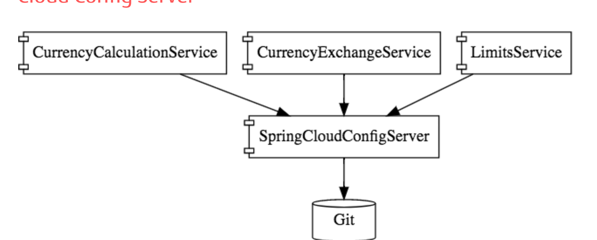
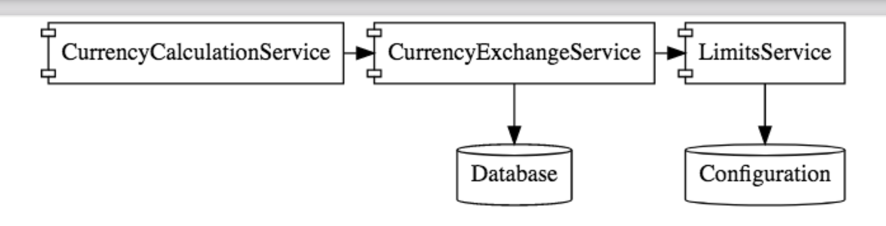
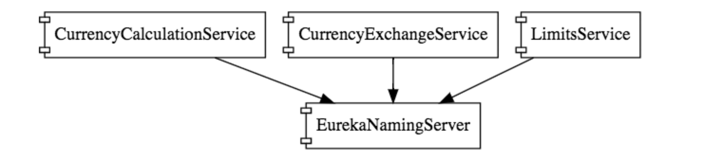

# Microservices With Spring Boot and Spring Cloud

This project is about building microservices using spring boot and spring cloud.

The main functionalities demonstrated in this project are:

 It has 3 different Micorservices used are:
 1. Limits Service
 2. Currency Exchange Service
 3. Currency Conversion Service

All 3 microservices are connnected to Spring Cloud Config Server and Git

`Spring Cloud Config Server`:   
All configurations of microservices of different environments, can be stored in 1 centralized place and Spring Cloud Config Server – helps expose these configurations to all microservices

Annotation: `@EnableConfigServer`

  

   

`H2 Database`:  
Currency Conversion Service interacts with Currency Exchange Service -> which intern is connected to H2 Database

  

 

`Feign`:  
Invoking of Currency Exchange Service from Currency Conversion Service happens via Feign Rest Client

•	The Feign is a declarative web service (HTTP client)  
•	When we use the RestTemplate to call the RESTful service, it creates duplication of code that talks to RESTful services.  
•	When we define Feign, we need only to define a proxy and define a single method into it. Feign helps us to simplify client code to talk to the RESTful web services.

Annotation: `@EnableFeignClient`

`Naming Server : Eureka`  
Eureka Server is set up   :`@EnableEurekaServer`  
Eureka Client dependency added for Currency Exchange Service, Currency Conversion Service and API Gateway

 

`Spring Cloud API Gateway`  
The API Gateway is a server. It is a single entry point into a system.
API Gateway is also responsible for request routing, composition, and protocol translation.  
Discovery is enabled via Locator in Application properties With Eureka For Spring Cloud Gateway

 `Spring-Cloud-Load-Balancer`:  
 	If Eureka and Feign used -> Client Side load balancing is done automatically

  `Circuit Breaker`:   
  Implemented using Resilience4j
  @Retry and Fallback methods added

  #### Ports

  |     Application       |     Port          |
  | ------------- | ------------- |
  | Limits Service | 8080, 8081, ... |
  | Spring Cloud Config Server | 8888 |
  | Currency Exchange Service | 8000, 8001, 8002, ..  |
  | Currency Conversion Service | 8100, 8101, 8102, ... |
  | Netflix Eureka Naming Server | 8761 |
  | Spring Cloud API Gateway Server | 8765 |

  #### URLs

|     Application       |     URL          |
| ------------- | ------------- |
| Limits Service | http://localhost:8080/limits http://localhost:8080/actuator/refresh  (POST)|
|Spring Cloud Config Server| http://localhost:8888/limits-service/default http://localhost:8888/limits-service/dev |
|  Currency Converter Service - Direct Call| http://localhost:8100/currency-converter/from/USD/to/INR/quantity/10|
|  Currency Converter Service - Feign| http://localhost:8100/currency-converter-feign/from/EUR/to/INR/quantity/10000|
| Currency Exchange Service | http://localhost:8000/currency-exchange/from/EUR/to/INR http://localhost:8001/currency-exchange/from/USD/to/INR|
| Eureka | http://localhost:8761/|
| API Gateway - Currency Exchange & Exchange Services | http://localhost:8765/currency-exchange-service/currency-exchange/from/EUR/to/INR http://localhost:8765/currency-conversion-service/currency-converter-feign/from/USD/to/INR/quantity/10|

  ## Dependencies
  |     Application       |     Dependencies         |
  | ------------- | ------------- |
  | limits-service | Web, DevTools, Actuator, Spring cloud config (Config Client) |
  | Spring-Cloud-Config-Server | Devtools, Spring cloud config (Config Server)|
  | Currency-Exchange-Service | Web, DevTools, Actuator, Config client |
  | Currency-Conversion-Service | Web, DevTools, Actuator, Config client |
  | Eureka naming server | Eureka Server, Config client, DevTools, Actuator |
  | Spring-Cloud-API-Gateway | Eureka Discover, Gateway, DevTools, Actuator |
